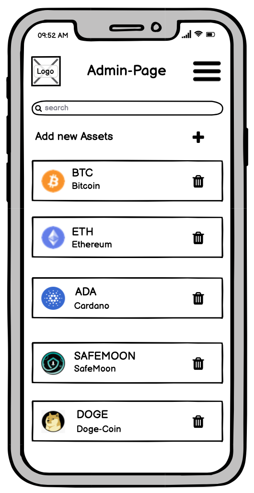

# **M151 / M152 - Krypto Trading Platform**

# Einführung

In diesem Projekt erstelle ich eine Platform, um mit Krypto-Währungen zu traden. Es wird dabei mit fiktivem Geld getradet und die Coins die man kauft, gehören einem danach natürlich nicht. Es gibt Admin Benutzer, die Krypto-Währungen hinzufügen können und auch bestehende Entfernen. Diese Admin-Nutzer können jedoch keine Währungen kaufen. Die "normalen" Benutzer können ihr Konto mit Spielgeld aufladen und damit dann die Währungen kaufen.

Im Frontend wird es eine Dashboard Seite geben, in der man einen Überblick seiner Investments und gekauften Assets sieht. Auf der zweiten Seite sieht meine Liste von allen verfügbaren Währungen. Wenn auf ein Item in der Liste geklickt wird, öffent sich eine Detail-Ansicht zu dieser Währung. Darin kann man den aktuellen Preis und evtl. auch einen Preis-Chart sehen. Zusätzlich kann man über die Detail-Ansicht auch kaufen oder verkaufen, sofern bereits Assets vorhanden sind.

# Personengruppen

**Hanspeter Meyer**

* 67 Jahre alt
* Pensioniert
* hat als Lastwagen-Chauffeur gearbeitet

_Quelle: [thispersondoesntexist.com](https://www.thispersondoesnotexist.com)_

Hanspeter hat sich mit seinem Job etwas angespart und hat im Internet von Krypto-Währungen gehört. Er möchte einen Teil seines erspartem in Krypto-Währungen investieren. Er möchte eine Plattform, auf der er einfach und unkompliziert seine Währungen kaufen kann und diese darauf hodln.

**Maria Jäger**

* 45 Jahre alt
* Architektin
* 7'000 CHF Lohn

_Quelle: [thispersondoesntexist.com](https://www.thispersondoesnotexist.com)_

Maria hat durch Ihren Sohn von Krypto-Währungen gehört und hat sich in den letzten Monaten sehr gut darüber informiert. Jetzt hat sie den Entschluss gefasst, dass sie monatlich 1'000 Franken in Krypto investieren möchte. Ihre Anforderungen an eine Trading-Platform sind, dass die Platform möglichst viele Coins im Portfolio hat, da sie besonders in Altcoins investieren möchte.

**Kevin Müller**

* 21 Jahre alt
* Ausbildung als Elektriker
* 950 CHF Lohn

_Quelle: [thispersondoesntexist.com](https://www.thispersondoesnotexist.com)_

Kevin hat von einem Kollegen gehört, der sein Investment verzehnfacht hat und möchte jetzt auch möglichst schnell viel Geld verdienen. Er hat bis jetzt nur von Bitcoin gehört und geht deshalb mit seinen 2500 CHF, die er sich erspart hat All-In. Er hofft auf den grossen Gewinn und möchte deshalb möglichst einfach sehen, um wie viel sein Investment bereits gewachsen ist.

**Philip Trummer**

* 29 Jahre alt
* CEO der Trading Platform
* verdient 30% des monatlichen Gewinns

_Quelle: [thispersondoesntexist.com](https://www.thispersondoesnotexist.com)_

Philip ist der CEO der ganzen Platform und damit ein Admin-Benutzer. Er möchte deshalb einerseits die Platform unterhalten, also neue Währungen hinzufügen oder bereits implementierte Entfernen. Anderseits möchte er aber auch selber investieren und dafür möchte er ein möglichst schönes Design und einen guten Überblick über seine Investments.

# User Stories

1. Als Benutzer möchte ich einen Account erstellen können, sodass ich mir die Platform anschauen kann.

1. Als Benutzer und Admin möchte ich mich mit einem Account anmelden können, sodass ich die Platform nutzen kann.

1. Als Benutzer möchte ich Geld auf mein Trading-Konto laden, sodass ich dieses Geld Investieren kann.

1. Als Benutzer möchte ich die aktuellen Preise der Währungen sehen, damit ich schnell und einfach einen Überblick über die Krypto-Welt haben kann.

1. Als Benutzer möchte ich eine Krypto-Währung möglichst schnell kaufen und verkaufen können, damit ich einen möglichst guten Preis bekomme.

1. Als Benutzer möchte ich ein Dashboard sehen, damit ich einen Überblick über meine gekauften Assets und über mögliche Gewinne oder Verluste habe.

1. Als Admin möchte ich neue Währungen hinzufügen können und bestehende löschen, damit die Benutzer eine möglichst gute Auswahl haben.

# Technologien

### Frontend
* Deno als Framework
* HTML
* CSS
* JavaScript

### Backend
* Java Spring als Framework
* Gradle als Package Manager

### Datenbank
* Postgres DB

### Zusätzlich
* Alle Teile werden in einem jeweiligen Docker Container laufen
* Eine API, um die aktuellen Krypto-Preise zu erhalten

# ERD

# Wireframes

## Login Page for Destkop

## Login Page for Mobile

## Portfolio Dashboard for Desktop

## Portfolio Dashboard for Mobile

## Prices Page for Desktop

## Prices Page for Mobile

## Detail Page for Desktop

## Detail Page for Mobile

## Account Page for Desktop

## Account Page for Mobile

## Admin Page for Desktop

## Admin Page for Mobile

## Admin Add Page for Desktop

## Admin Add Page for Mobile
